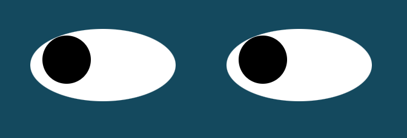

# Name: EyeExercise

## Description: 
Eye exercise is a project to demonstrate my JavaScript, CSS & html skills. In this project, the eye moves with the mouse dynamically. 

## Installation: 
1. Download the project to your desktop. If zipped, unzip it. 
2. Open index.html file in a browser to see the bouncing of the ball. 

## Usage: 
Use this project to play with JavaScript, CSS features and to improve your html skills.

## Support: 
There are many support portals available for JavaScript like MDN, StackOverflow, etc. You can use this forum to research various styles and ask questions.

## Roadmap: 
The future of this project is to make the eyes roll when a button is clicked and change the colors of the eyes. 

## License information: 

See MIT license release in repository.
